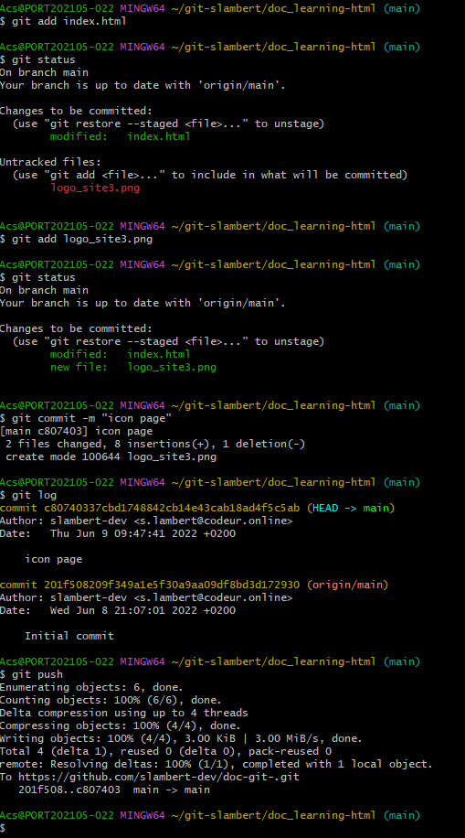

# Git.Bash vs Git Hub #

### - Versionner un nouveau git sur Git Hub (à distance) :alien:

 

- Versionner un Git Commandes 💯 avec Git Bash ou le terminal VSCode

- Aller sur son dossier source cd (nom du dossier source ; ex: /C:/Acs/git-moi/doc1)
  
-  vérifier si il y'a un git , git status
  
- écrire  sur Git Bash ou le terminal  VisualCode " git add "
  
- Puis git commit -m "nom" (nom de notre commit souvent "Initial commit)
Regarder le status de notre git ave la commande " git status" 
  
- Ecrire la commande git log  pour vérifier si le commit à bien été fait
  
  GIT HUB Versionner
- le mettre sur git Hub si on souhaite  avec la commande " git push "
  
- Autoriser l'accès VS à notre compte Git Hub 
  
- Vérifier notre onglet "Repositories" dans notre page d'acceuil Git Hub
  
  Autre description
-  1) mettre sur un git hub existant: git push ( ouverture d'une page git autoriser sur le navigateur et ensuite se connecter , rafraichir son repisitories, remarquer les projets locals au Github à distance )

Commande incroyable qui fait tout en même temps :  git commit -am

#### - Quelques commandes sympathiques: 

